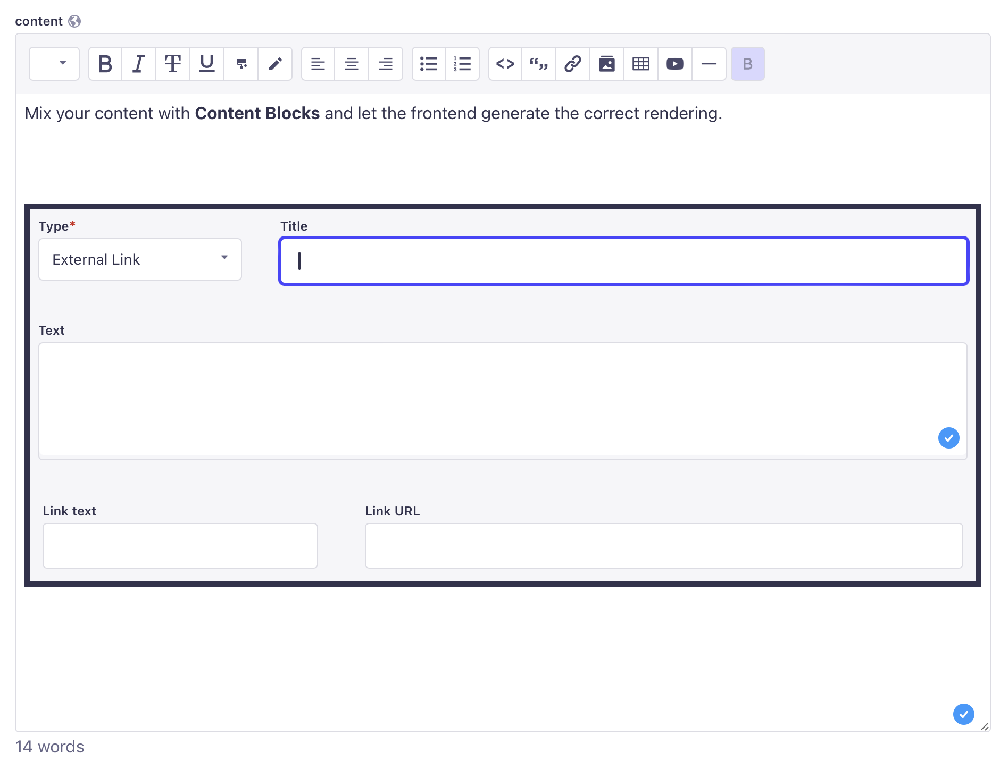
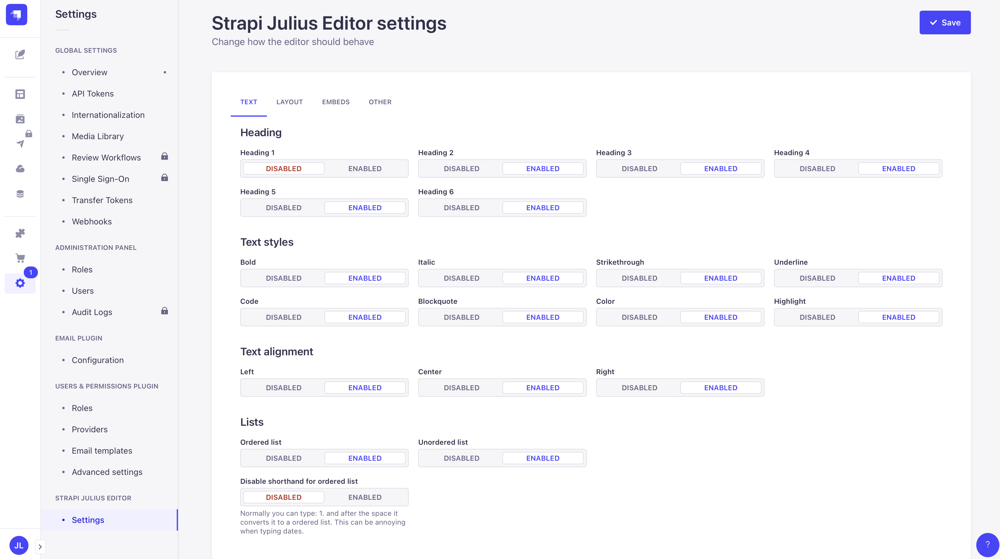

# Strapi Julius Editor
A drop-in replacement for the strapi editor based on TipTap.
It support usual text formatting, tables, and css columns and content blocs (still in dev).
We also plan to add AI based content generation in the future.


 

## Notice!
This is a fork of the original [strapi-tiptap-editor](https://github.com/dasmikko/strapi-tiptap-editor)

## What is this?
It's a dead simple, and easy to use drop-in replacement for the built-in strapi WYSIWYG editor. It's build upon the [TipTap editor](https://tiptap.dev/).
It saves as plain HTML, making it easy to use with various frontends.


## Why make this?
Needed a better editor for a project, and the current options didn't cut it. So I made this.

## Requirements
It's build for Strapi **v4**. 


## Install 
Luckily it's very easy to use. Just follow these instructions:

```
# Install the dependency
npm install strapi-julius-editor

or 

yarn add strapi-julius-editor
```

# Add the following to the webpack config (/src/admin/webpack.config.js)
This is due to tippy.js doesn't have an ES6 module, and a tiptap depencency imports it (thanks for the help @giu1io)
config.plugins.push(new webpack.NormalModuleReplacementPlugin(
  /^tippy\.js$/,
  'tippy.js/dist/tippy-bundle.umd.min.js'
))

# Build the Strapi Admin
npm run build


# Setting up the editor
You should now be able to access to the editor settings in the Strapi admin. 

 

